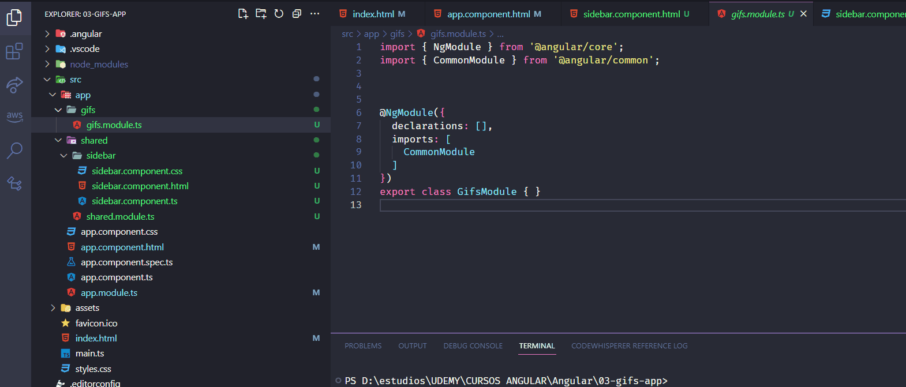

# foldercreator-3ntr0pia README

The "foldercreator-3ntr0pia" extension for Visual Studio Code allows users to quickly create folders with predefined names through a simple selection interface.

La extensión "foldercreator-3ntr0pia" para Visual Studio Code permite a los usuarios crear rápidamente carpetas con nombres preestablecidos a través de una interfaz de selección sencilla.

## Features

Quick Selection / Selección rápida: Easily choose from a list of predefined folder names.

Elige fácilmente de una lista de nombres de carpetas predefinidos.

One-click Creation / Creación con un clic: Once you've selected the desired folders, create them all with a single click.

Una vez seleccionadas las carpetas deseadas, créalas todas con un solo clic.

VS Code Integration / Integración con VS Code: Works directly from the VS Code command palette.

Funciona directamente desde la paleta de comandos de VS Code.

## Requirements

Visual Studio Code version 1.50 or higher.

Visual Studio Code versión 1.50 o superior.

## Extension Settings

Currently, this extension does not provide any specific settings.
However, future updates might include customizable settings to enhance user experience.

Actualmente, esta extensión no proporciona configuraciones específicas. Sin embargo, las actualizaciones futuras podrían incluir configuraciones personalizables para mejorar la experiencia del usuario.

## Known Issues

None at the moment. If you encounter any issues, please report them in the repository's issues section.

Ninguno por el momento. Si encuentras algún problema, por favor, reporta en la sección de issues del repositorio.

### 1.0.0

Initial release of foldercreator-3ntr0pia.

**Enjoy!**
